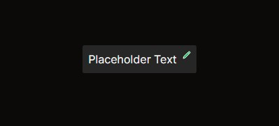

# Componente de Conteúdo Editável

Você pode usar este componente de várias formas, entre elas:

- Título Editável
- Célula de Tabelas
- Ou qualquer outro lugar que necessite atualizar um determinado campo

O exemplo de utilização pode ser encontrado em `app\example\editable-content\page.tsx`

```javascript
"use client";
import { EditableContent } from "@/components/ui/extension/editable-content"

const Page = () => {

    const handleSave = (value: unknown) => {
        console.log(value);
    }

    return (
        <div className="flex flex-col w-full min-h-full items-center justify-center">
            <EditableContent initialValue="Placeholder Text" action={handleSave} />
        </div>
    )
}

export default Page
```



Básicamente você precisa criar uma função que respnderá ao evento de `Tab|Escape|Enter|Blur`
para que seja invocada.

